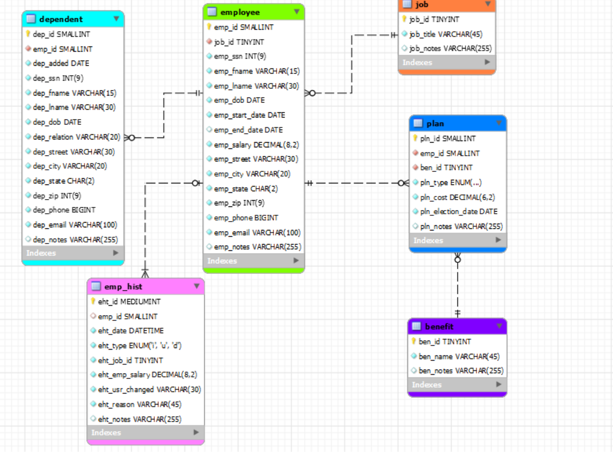
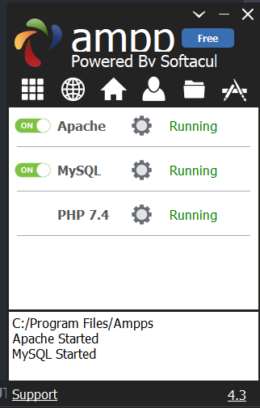

# LIS3781 - Advanced Database Management

## Joseph Fernandez

### Assignment 1 Requirements:

1. Distributed Version Control with Git and Bitbucket
2. AMPPS Installation
3. Questions
4. Eneity Relationship Diagram and SQL code (optional)
5. Bitbucket repo links:
    a) this assignment and
    b) the completed tutorial (bitbucketstationlocations).

## A1 Database Business Rules

The human resource (HR) department of the ACME company wants to contract a database
modeler/designer to collect the following employee data for tax purposes: job description, length of
employment, benefits, number of dependents and their relationships, DOB of both the employee and any
respective dependents. In addition, employees’ histories must be tracked. Also, include the following
business rules:

* Each employee may have one or more dependents.
* Each employee has only one job.
* Each job can be held by many employees.
* Many employees may receive many benefits.
* Many benefits may be selected by many employees (though, while they may not select any benefits—
any dependents of employees may be on an employee’s plan).

In Addition:

* Employee: SSN, DOB, start/end dates, salary;
* Dependent: same information as their associated employee (though, not start/end dates), date added
as dependent), type of relationship: e.g., father, mother, etc.
* Job: title (e.g., secretary, service tech., manager, cashier, janitor, IT, etc.)
* Benefit: name (e.g., medical, dental, long-term disability, 401k, term life insurance, etc.)
* Plan: type (single, spouse, family), cost, election date (plans must be unique)
* Employee history: jobs, salaries, and benefit changes, as well as who made the change and why;
* Zero Filled data: SSN, zip codes (not phone numbers: US area codes not below 201, NJ);
* *All* tables must include notes attribute.

#### README.md file should include the following items:

* git commands wth short descriptions
* Link to Assignment 1 solutions file
* screenshot of A1 ERD
* screenshot of AMPPS installation

> #### Git commands w/short descriptions:

1. git init - creates an empty git repository
2. git status - Displays paths tat have differeces between the index file and the current head commit
3. git add - Updates te index using the current content found in the working tree
4. git commit - Creates a new commit containing the current contents of the index and the given log message describing the changes
5. git push - Updates remote refs using local refs
6. git pull - INcorporates changes from a remote repository into the current branch
7. git fetch - fetches branches and tags from one or more other repositories

#### Assignment Screenshots:

[A1 Solutions](lis3781_a1_solutions.sql "My solutions file")

*Screenshot of Assignment ERD*:

*Screenshot of AMPPS*:

