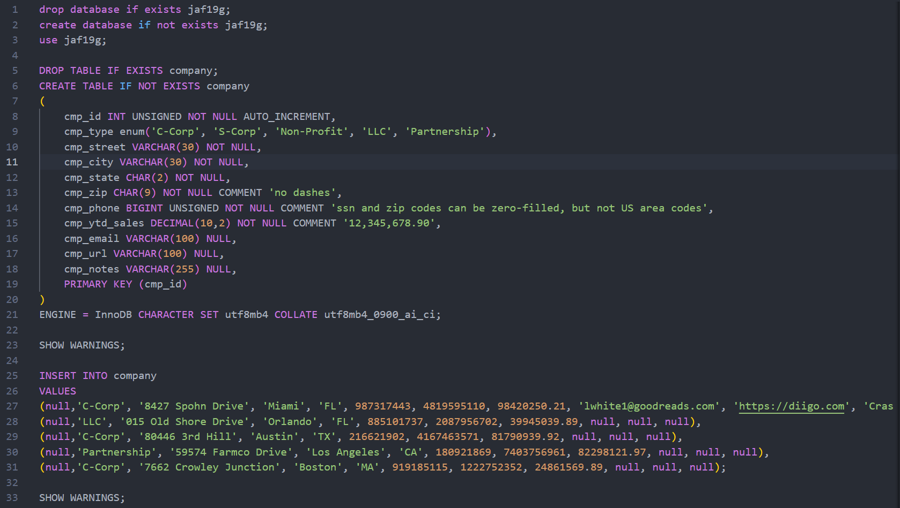
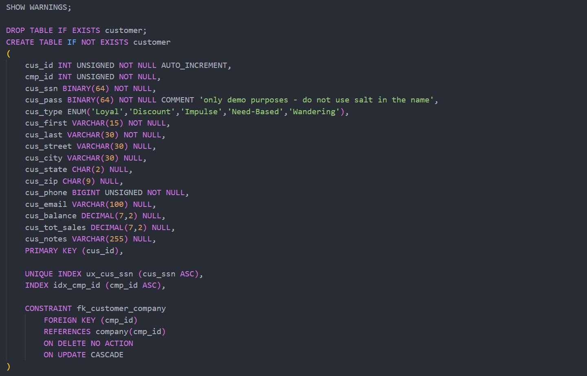
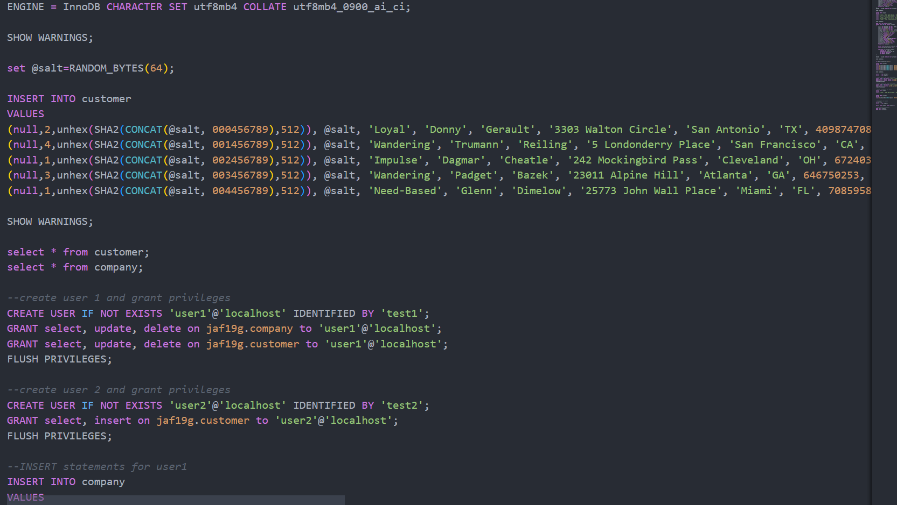
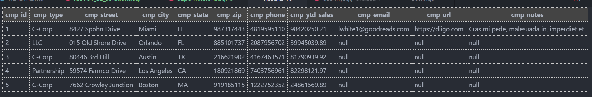
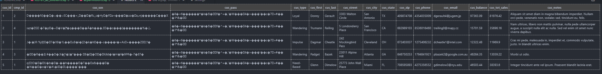

# LIS3781 - Advanced Database Management

## Joseph Fernandez

### Assignment 2 Requirements:

1. Insert 2 tables into both local server and remote server
2. Create priliveges for 2 new users within the local server
3. Observe the query results for new users based on permissions

#### README.md file should include the following items:

* Screenshts of SQL Code
* Link to Assignment 2 solutions file
* Screenshots of populated tables

### Solution File

[A2 Solutions](lis3781_a2_solutions.sql "My solutions file")

#### Assignment Screenshots:

*Screenshots of SQL Code*:

*Screenshots of Populated Tables*

