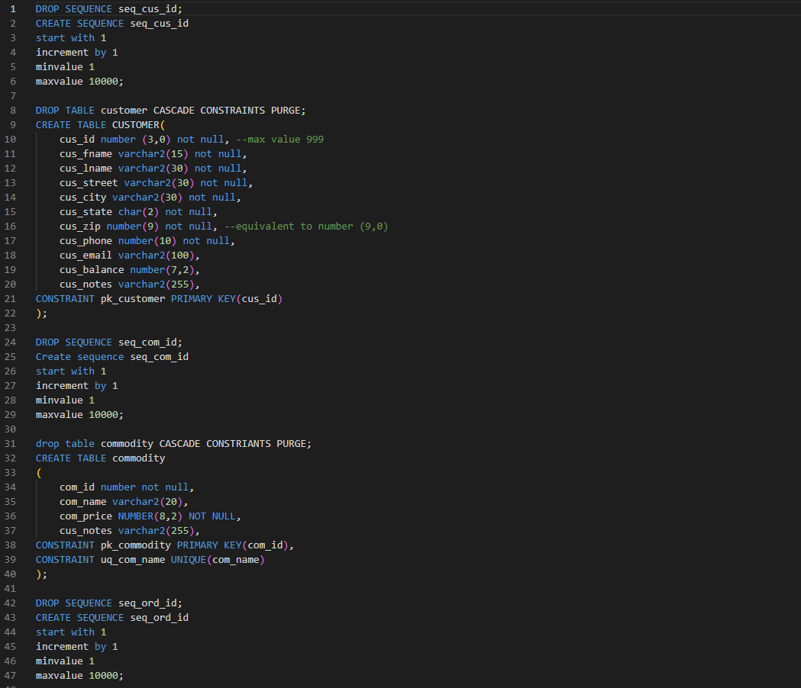
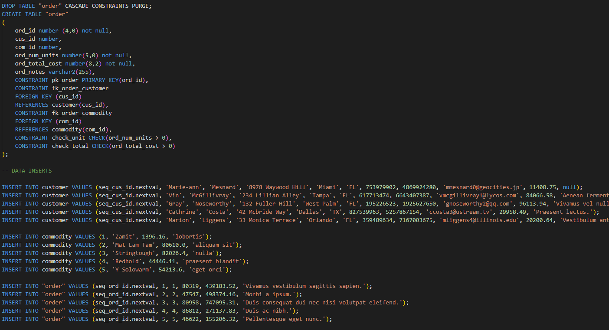
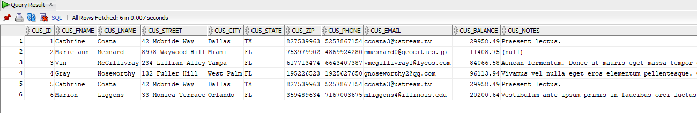
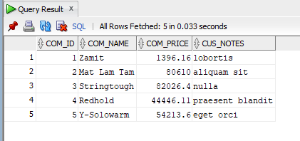
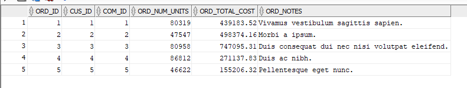
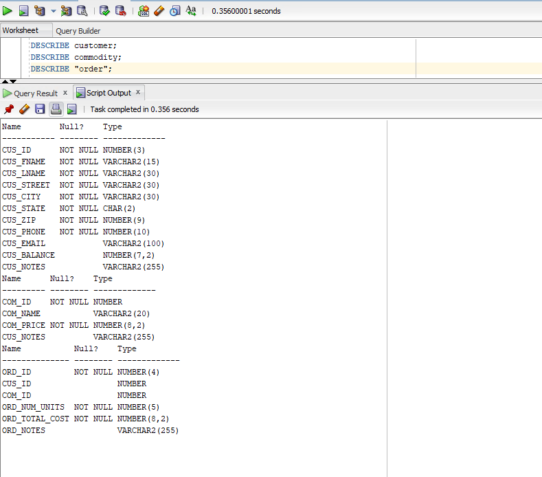

# LIS3781 - Advanced Database Management

## Joseph Fernandez

### Assignment 3 Requirements:

1. Log into Oracle Server using RemoteLabs
2. Create and populate Oracle tables
3. Forward engineer data to Oracle SQL Server

#### README.md file should include the following items:

* Screenshot of *your* SQL code used to create and populate your tables;
* Screenshot of populated tables within oracle environment
* Screenshot at least one required report and SQL code solution
* Link to your lis3781_a3_solutions.sql file

### Solution File

[A3 Solutions](lis3781_a3_solutions.sql "My solutions file")

#### Assignment Screenshots:

*Screenshots of SQL Code*:

*Screenshots of Populated Tables*

*Screenshot of Required Report*:

