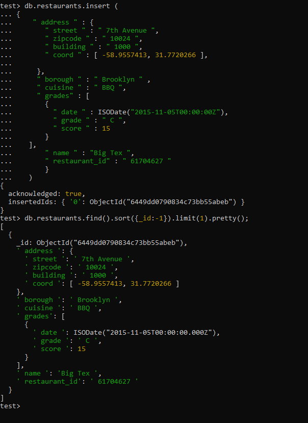
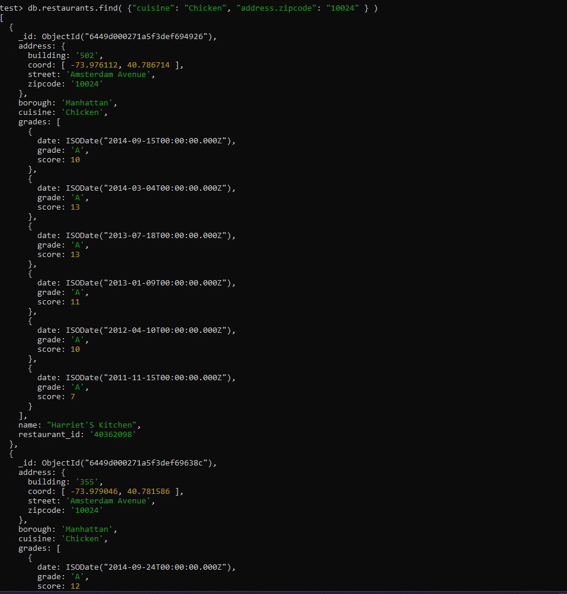

# LIS3781 - Advanced Database Management

## Joseph Fernandez

### Project 2 Requirements:

* Work in MongoDB, a document database program classified as a NoSQL database program.

1. Display all documents in collection.
2. Display the number of documents in collection.
3. Retrieve 1st 5 documents.
4. Retrieve restaurants in the Brooklyn borough.
5. Retrieve restaurants whose cuisine is American.
6. Retrieve restaurants whose borough is Manhattan and cuisine is hamburgers.
7. Display the number of restaurants whose borough is Manhattan and cuisine is hamburgers.
8. Query zipcode field in embedded address document.
Retrieve restaurants in the 10075 zip code area.
9. Retrieve restaurants whose cuisine is chicken and zip code is 10024.
10. Retrieve restaurants whose cuisine is chicken or whose zip code is 10024.
11. Retrieve restaurants whose borough is Queens, cuisine is Jewish/kosher, sort by descending order
of zipcode.
12. Retrieve restaurants with a grade A.
13. Retrieve restaurants with a grade A, displaying only collection id, restaurant name, and grade.
14. Retrieve restaurants with a grade A, displaying only restaurant name, and grade (no collection id):
15. Retrieve restaurants with a grade A, sort by cuisine ascending, and zip code descending.
16. Retrieve restaurants with a score higher than 80.
17. Insert a record with the following data:
street = 7th Avenue
zip code = 10024
building = 1000
coord = -58.9557413, 31.7720266
borough = Brooklyn
cuisine = BBQ
date = 2015-11-05T00:00:00Z
grade" : C
score = 15
name = Big Tex
restaurant_id = 61704627
18. Update the following record:
Change the first White Castle restaurant document's cuisine to "Steak and Sea Food," and update the
lastModified field with the current date.
19. Delete the following records:
Delete all White Castle restaurants.

#### README.md file should include the following items:

* Screenshts of at least one MongoDB shell command
* Screenshot at least one required report 
* Bitbucket repo links: *Your* lis3781 Bitbucket repo link

### Required Report Solution File

[Required Report](requiredreport.json "My solutions file")

#### Assignment Screenshots:

*Screenshots of Required Report*

*Screenshot of shell command*:

